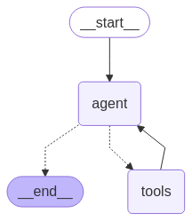

# AI Agents实战项目第2篇：LangGraph 入门

在第一篇中，我们对agent的概念和发展历程有了一定的认识，为了能更好的构建智能体，接下来，我们将学习如何使用 LangGraph。

很多优秀的 DeepResearch 应用都是基于 LangGraph 构建的，比如：
- 字节跳动开源的 DeerFlow (https://deerflow.tech/)
- 谷歌开源的 Gemini Fullstack LangGraph Quickstart (https://github.com/google-gemini/gemini-fullstack-langgraph-quickstart)

## 什么是LangGraph

[LangGraph](https://langchain-ai.github.io/langgraph/concepts/high_level/)是一个专门用于构建任意工作流程（Workflow）和智能体（Agent）的基础设施框架。与许多追求简化操作的No-code或Low-code开发框架不同，LangGraph选择了一条更加透明和可控的道路——它不对提示词或架构进行过度的抽象封装，而是直接为开发者提供三项核心优势：

**控制（Control）**：你可以轻松地定义或组合任意的工作流程和智能体，每一个环节都在你的掌控之中。

**持久化（Persistence）**：框架能够持久化存储图状态，这使得开发记忆功能和人类干预功能成为可能。

**测试、调试、部署（Testing, Debugging, Deployment）**：提供了完善的测试、调试和部署支持，让你的开发过程更加顺畅。

这种设计理念意味着，当你使用LangGraph时，你不会被框架的"黑盒"所束缚，而是能够清楚地了解每一步的执行逻辑，并根据需要进行精确的调整。

## 控制能力：构建你的第一个图（Graph）

### 理解核心概念

在 LangGraph 中，LLM应用被定义为一个图结构，这个图包含三个基本要素：

- **图状态（Graph State）** Graph State 是任何基于 LangGraph 的LLM应用的核心，任务执行过程中所需要的所有信息都会存储在 Graph State 中
- **节点（Nodes）**：节点是更新State的执行单元，我们需要定义在哪些节点更新State信息
- **边（Edges）**：边是节点流转的路径，描述了节点之间的连接关系

简单来说，Graph State是LangGraph的核心，Nodes是更新State的执行单元，而Edges则是节点流转的路径。

### 定义 State schema

LangGraph中，使用 `StateGraph` 类来表示一个图。 在初始化 `StateGraph` 之前，我们需要定义一个State schema，它可以是Python中任何带有`getattr()`方法的对象，比如字典、类或者Pydantic对象。不同的选择有不同的特点：

- `TypedDict`：速度很快，但不支持默认值
- `dataclass`：也很快，支持`state.foo`的访问方式，支持默认值  
- `Pydantic`：速度较慢，但支持数据验证

让我们从一个简单的例子开始。首先，我们使用TypedDict来定义一个StateGraph对象：

```python
import sys
sys.path.append("..")
from typing import TypedDict
from langgraph.graph import StateGraph, START, END

from src.agents_intro import model_with_tools, write_email # 导入之前的代码
from src.utils import show_graph

class StateSchema(TypedDict):
    request: str
    email: str

workflow = StateGraph(StateSchema)
```

这里我们定义了一个包含`request`和`email`两个字段的 State schema，然后用它初始化了一个`StateGraph`对象，名称为 `workflow`。

### 添加节点（Nodes）和边（Edges）

实际应用的图中，会有很多边和节点，边是不需要定义的，但是节点需要提前定义好。节点的作用是更新 graph state，更新的方式需要关注一下，默认情况下，如果节点中更新了某个key的值，会直接覆盖旧的值，返回值中没有涉及的字段不会被更新。

```python
def write_email_node(state: StateSchema) -> StateSchema:
    # 处理请求的具体代码
    output = model_with_tools.invoke(state['request'])
    args = output.tool_calls[0]['args']
    email = write_email.invoke(args)
    return {'email': email}  # 只更新email字段，request字段保持不变
```

在这个函数中，`email`字段被覆盖更新，而`request`字段并未更新，因此保持不变。

> LangGraph也支持自定义更新的逻辑。

定义好节点后，我们需要将节点和边添加到图中：

```python
workflow = StateGraph(StateSchema)
workflow.add_node("write_email_node", write_email_node)
workflow.add_edge(START, "write_email_node")
workflow.add_edge("write_email_node", END)

app = workflow.compile()
```

上述代码需要注意几个要点：
- `START`和`END`是LangGraph默认的开始和结束节点
- 边不需要单独定义，只需要指定连接关系
- 图需要`compile`之后才能运行

### 执行简单流程

现在我们可以执行这个简单的工作流程：

```python
result = app.invoke({
    "request": "写一封邮件给张三，主题是关于项目进展，内容是：我们正在按照计划推进项目，预计下周完成。"
})
```

执行后，图状态被更新，`request`字段保持不变，`email`字段更新为`write_email`的输出。这个流程是一个非常简单的直线流转：`Start -> write_email_node -> End`。

### 构建条件分支流程

在实际应用中，我们经常需要根据不同条件执行不同的逻辑。LangGraph支持条件边，让节点间的流转可以按条件执行。

首先，我们定义两个新的节点：
- `call_llm` 用于根据用户的请求调用LLM
- `run_tool` 用于执行LLM输出的工具调用

```python
from langgraph.graph import MessagesState

def call_llm(state: MessagesState) -> MessagesState:
    """运行LLM"""
    output = model_with_tools.invoke(state['messages'])
    return {"messages": [output]}

def run_tool(state: MessagesState) -> MessagesState:
    """执行工具调用"""
    result = []
    for tool_call in state["messages"][-1].tool_calls:
        observation = write_email.invoke(tool_call['args'])
        result.append({
            "role": "tool",
            "content": observation,
            "tool_call_id": tool_call["id"]
        })
    return {"messages": result}
```

这里有几个重要概念需要说明：

- `MessagesState`是一个预定义的StateGraph子类，包含`messages`字段
- 当节点更新`messages`字段时，会自动扩展（extend）初始数据，而不是覆盖
- `run_tool`中的`observation`很好地体现了工具的作用：**与环境交互，并返回交互结果作为LLM对外部环境的观察**

接下来，我们定义条件判断函数：

```python
from typing import Literal

def should_continue(state: MessagesState) -> Literal["run_tool", "__end__"]:
    """判断是否需要转到工具处理器，或者结束"""
    messages = state["messages"]
    last_message = messages[-1]
    
    # 如果最后一条消息是工具调用
    if last_message.tool_calls:
        return "run_tool"
    # 否则，停止（回复用户）
    return END

NODE_NAME_MAPPER = {
    "run_tool": "run_tool",
    END: END
}
```

这个函数判断是否需要使用工具，并将返回值映射到对应的节点名称。注意这里的`END`可以理解成和`__end__`是同一个内容。

最后，我们通过`add_conditional_edges`函数将条件判断加入到图中：

```python
workflow = StateGraph(MessagesState)
workflow.add_node("call_llm", call_llm)
workflow.add_node("run_tool", run_tool)
workflow.add_edge(START, "call_llm")
workflow.add_conditional_edges("call_llm", should_continue, NODE_NAME_MAPPER)
workflow.add_edge("run_tool", END)

app = workflow.compile()
```

这样，我们就构建了一个具有条件分支的智能体，它能够根据LLM的输出决定是否需要调用工具。结构如下图所示：


### 使用预构建的智能体

为了方便开发者快速构建智能体，LangGraph提供了一个抽象方法。使用这个方法你可以快速的构建agent，你只需要提供：
- LLM作为大脑
- 一组工具
- Prompt指令

```python
from langgraph.prebuilt import create_react_agent

agent = create_react_agent(
    model=llm,
    tools=[write_email],
    prompt="使用提供的工具完成用户的请求",
)
```

上述代码创建了一个 ReAct agent，这个预构建的智能体本质上就是LLM借助工具与环境的循环交互，它会自动处理工具调用的逻辑。它的结构图如下：



## 持久化能力：赋予智能体记忆

LangGraph的持久化功能是其一大亮点，它可以持久化存储图状态，使开发记忆功能和人类干预功能成为可能。

### 理解持久化概念

在深入使用持久化功能之前，我们需要理解几个核心概念：

**Thread（线程）**：表示围绕一个特定主题展开的一系列相关讨论或消息的集合，即"主题线索"或"讨论串"。在LangGraph中，thread可以理解为一次任务执行过程中不同时间点的所有状态的集合。

**Checkpoint（检查点）**：表示在某个时间点thread的快照，里面存储着当前时间点的状态信息。

**Super-step（超级步骤）**：任务执行过程中，每个顺序执行的节点被称为一个super-step。

从概念上讲，快照（StateSnapshot）、Checkpoint、Super-step是同一时间点的不同层次的概念表达。正如官方文档所说："Checkpoint is a snapshot of the graph state saved at each super-step and is represented by StateSnapshot object."


有了持久化能力后，任何时间任何步骤的状态信息都可以被存储下来，这为我们后续在智能体中实现中断、回溯、恢复等一系列功能提供了基础。

### 选择合适的存储方式

Checkpoint是LangGraph中针对持久化存储所设计的一个抽象类，它定义了如何将状态信息存储到不同的介质中。LangGraph提供了多种Checkpoint的实现：

- `InMemorySaver`：将状态信息存储到内存中
- `SqliteSaver`：将状态信息存储到SQLite数据库中  
- `PostgresSaver`：将状态信息存储到PostgreSQL数据库中

让我们使用`InMemorySaver`来演示如何使用持久化功能：

```python
from langgraph.checkpoint.memory import InMemorySaver

agent = create_react_agent(
    model=llm,
    tools=[write_email],
    prompt="使用提供的工具完成用户的请求",
    checkpointer=InMemorySaver(),
)
```

对于自定义构建的智能体，你可以使用`graph = workflow.compile(checkpointer=InMemorySaver())`来指定持久化存储的实现。

### 实现对话记忆

现在让我们看看持久化如何在实际应用中发挥作用。首先，我们需要为每个对话线程指定一个唯一的 `thread_id`，它完全是自定义的，一个新的 `thread_id`表示一个新的任务的开始：

```python
config = {"configurable": {"thread_id": "1"}}  # 指定当前thread的id

result = agent.invoke({
    "messages": [{
        "role": "user",
        "content": "给出一些写邮件的建议",
    }]
}, config)
```

通过`get_state`方法，我们可以通过`thread_id`获取最新的状态。最新的state中保留着所有的历史对话信息：

```python
config = {"configurable": {"thread_id": "1"}}
state = agent.get_state(config)

for message in state.values["messages"]:
    message.pretty_print()
```

当我们继续对话时，新的对话内容会被添加到最新的state中，实现了真正的对话记忆功能：

```python
# 继续对话
result = agent.invoke({
    "messages": [{
        "role": "user", 
        "content": "很好，请使用第3条建议，给我的同事写一封信，告诉他项目进度一切正常。",
    }]
}, config)
```

智能体能够记住之前提到的"第3条建议"，并据此生成相应的邮件内容。这展示了持久化功能如何让智能体具备了上下文记忆能力。

### 查看历史状态

LangGraph还提供了查看历史状态的功能。通过`get_state_history`方法，你可以获取某个thread的所有历史状态：

```python
history = agent.get_state_history(config)
for state in history:
    print(f"Step: {state.step}, Next: {state.next}")
```

这个功能对于调试和理解智能体的执行过程非常有用，你可以清楚地看到每一步的状态变化。

## 总结

通过这篇文章，我们深入了解了LangGraph的两大核心能力：控制和持久化。

在**控制能力**方面，LangGraph为我们提供了一个清晰而灵活的图构建方式。通过State、Nodes和Edges的组合，我们可以构建从简单的线性流程到复杂的条件分支流程。无论是自定义构建还是使用预构建的智能体，LangGraph都给了开发者足够的控制权，让你能够精确地定义智能体的行为逻辑。

在**持久化能力**方面，LangGraph通过Thread、Checkpoint和Super-step的概念，为智能体提供了强大的状态管理和记忆功能。这不仅让智能体能够记住历史对话，还为实现更复杂的功能（如中断恢复、人类干预等）奠定了基础。

LangGraph的设计哲学是透明和可控，它不会将复杂性隐藏在抽象层后面，而是让开发者能够清楚地了解每一个环节的工作原理。这种设计让LangGraph成为了构建生产级智能体应用的理想选择。

当你开始使用LangGraph时，建议从简单的线性流程开始，逐步掌握State、Nodes和Edges的使用方法，然后再探索条件分支和持久化功能。随着对框架理解的深入，你会发现LangGraph为构建复杂智能体系统提供了无限的可能性。
