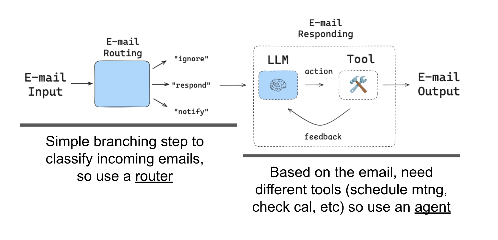
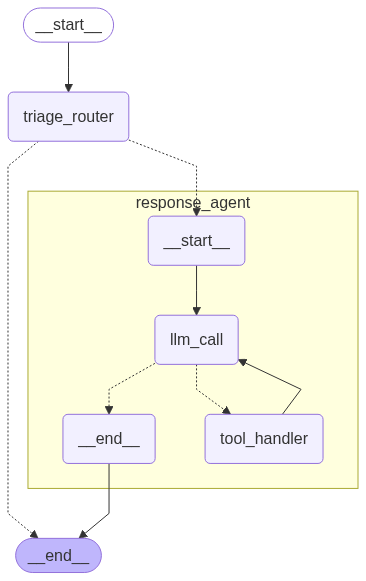

# 构建智能体：邮件助手（Email Assistant）的完整实现指南

在前面的章节中，我们了解了智能体的基本概念和 LangGraph 的核心功能。现在，让我们将这些知识付诸实践，构建一个真正有用的智能体——邮件助手（Email Assistant）。这个智能体不仅能够自动分类和回复邮件，还为后续的人类干预和记忆功能奠定了基础。

项目开源地址：[https://github.com/simfeng/agents-from-scratch](https://github.com/simfeng/agents-from-scratch)

本节的notebook地址为： [https://github.com/simfeng/agents-from-scratch/blob/main/03-building-agents/notebook.ipynb](https://github.com/simfeng/agents-from-scratch/blob/main/03-building-agents/notebook.ipynb)

<!-- toc here -->

## 系统架构概览

我们要构建的邮件助手采用模块化设计，整体架构如下图所示：


整个系统包含以下几个核心模块：

- **Agent(LangGraph)**：本节要实现的核心内容，一个能自动分类邮件并进行回复的智能体
- **Interrupt -> Human Feedback**：通过中断功能实现人类反馈（后续章节详细介绍）
- **Memory(Updating)**：记忆功能（后续章节详细介绍）
- **E-mail Response Draft & E-mail Service**：工具调用模块

本节将专注于 **Agent(LangGraph)** 模块的实现，该模块分为两个关键部分：

1. **Router（路由模块）**：负责分析邮件应该如何处理
2. **Response Agent（邮件回复模块）**：负责根据邮件分类的结果，撰写并回复邮件，但是在本节内容中，不会实现邮件的发送功能，而是用一部分打印输出代替

## Tools 定义：智能体的能力基础

在构建智能体之前，我们需要明确它能够使用哪些 Tools（工具）。Tools 是智能体与外部环境交互的桥梁，定义了智能体的能力边界。

我们将定义四个核心 Tools：

### 1. 邮件撰写工具

```python
@tool
def write_email(to: str, subject: str, content: str) -> str:
    """Write and send an email."""
    # Placeholder response - in real app would send email
    return f"Email sent to {to} with subject '{subject}' and content: {content}"
```

这个工具负责起草并发送邮件。需要注意的是，起草是根据 LLM 已经撰写好的邮件内容，转成实际邮件发送接口所需的形式，然后再调用接口发送。在本节内容中，我们暂不实现这些功能，而是用打印输出代替实际的邮件发送。

### 2. 会议安排工具

```python
@tool
def schedule_meeting(
    attendees: list[str], subject: str, duration_minutes: int,
    preferred_day: datetime, start_time: int
) -> str:
    """Schedule a calendar meeting."""
    # Placeholder response - in real app would check calendar and schedule
    date_str = preferred_day.strftime("%A, %B %d, %Y")
    return f"Meeting '{subject}' scheduled on {date_str} at {start_time} for {duration_minutes} minutes with {len(attendees)} attendees"
```

当邮件涉及会议安排时，这个工具能够帮助智能体创建日程安排。

### 3. 日程查询工具

```python
@tool
def check_calendar_availability(day: str) -> str:
    """Check calendar availability for a given day."""
    # Placeholder response - in real app would check actual calendar
    return f"Available times on {day}: 9:00 AM, 2:00 PM, 4:00 PM"
```

在安排会议前，智能体需要先查询可用的时间段。

### 4. 任务完成标记

```python
@tool
class Done(BaseModel):
    """E-mail has been sent."""
    done: bool
```

这个Tool比较特殊，它使用 `pydantic.BaseModel` 实现，而不是普通函数。这是因为 LangChain 的 `@tool` 装饰器被设计为多态的，能够智能地处理不同类型的输入，并将它们统一转换为符合工具接口的对象。

`Done` Tool 的作用是标记任务已经完成，告诉智能体可以结束当前的工作流程。

## Router 模块：智能的邮件分类系统

Router 模块是整个系统的"大脑"，负责分析输入的邮件内容，决定下一步应该如何处理。这种单一职责的设计是一个很好的架构实践。



### State 设计

使用 LangGraph 构建智能体时，首先需要明确哪些信息需要被记录和传递。我们创建一个自定义的 State 对象，继承自 LangGraph 的预构建 `MessagesState`：

```python
from langgraph.graph import MessagesState

class State(MessagesState):
    email_input: dict
    classification_decision: Literal["ignore", "respond", "notify"]
```

这个 State 类包含三个字段：

- **messages**：继承自 `MessagesState`，用于存储对话历史
- **email_input**：用于存储输入的邮件信息
- **classification_decision**：用于存储 Router 的决策结果

### 结构化输出的实现

为了确保大语言模型的输出格式符合我们的预期，我们使用 Pydantic Model 来定义结构化输出：

```python
class RouterSchema(BaseModel):
    """Analyze the unread email and route it according to its content."""
    
    reasoning: str = Field(
        description="Step-by-step reasoning behind the classification."
    )
    classification: Literal["ignore", "respond", "notify"] = Field(
        description="The classification of an email: 'ignore' for irrelevant emails, "
        "'notify' for important information that doesn't need a response, "
        "'respond' for emails that need a reply",
    )
```

这个模式定义了两个字段：

- **reasoning**：分类邮件的推理过程，帮助我们理解智能体的决策逻辑
- **classification**：邮件分类结果，包含三种可能的值

在实际处理过程中，LangChain 会将这个类转换成相应的提示词发给大语言模型，指导其按照指定格式输出结果。这个提示词大概长这样：

```
You are to return a JSON object that matches the following schema:
{
  "reasoning": "string",
  "classification": "string"
}
```

### 结构化输出的配置

接下来，我们初始化 LLM，并通过 `with_structured_output` 方法来指定 LLM 的输出格式：

```python
llm = init_chat_model(model_name, model_provider=model_provider, temperature=0)
llm_router = llm.with_structured_output(RouterSchema)
```

> **重要提示**：`with_structured_output` 方法对 qwen 相关的模型并不支持，建议使用 openai 的模型。如果实际项目中使用 qwen 的模型，可以添加一些方法来实现相同的功能：
> 1. 将 `RouterSchema` 转成 prompt
> 2. 将 LLM 的输出转成 `RouterSchema` 的格式

### Router 的 Prompt 设计

Router 模块的核心在于精心设计的 prompt，它指导 LLM 如何分析和分类邮件。让我们来看看实际使用的 prompt 内容：

#### System Prompt（系统提示词）

```
< Role >
Your role is to triage incoming emails based upon instructs and background information below.
</ Role >

< Background >
I'm Lance, a software engineer at LangChain.
</ Background >

< Instructions >
Categorize each email into one of three categories:
1. IGNORE - Emails that are not worth responding to or tracking
2. NOTIFY - Important information that worth notification but doesn't require a response
3. RESPOND - Emails that need a direct response
Classify the below email into one of these categories.
</ Instructions >

< Rules >
{triage_instructions}
</ Rules >
```

#### User Prompt（用户提示词）

```
Please determine how to handle the below email thread:

From: {author}
To: {to}
Subject: {subject}
{email_thread}
```

#### 分类规则详解

在 `< Rules >` 部分，我们定义了详细的分类规则：

**不值得回复的邮件（IGNORE）：**
- 营销通讯和促销邮件
- 垃圾邮件或可疑邮件
- 仅作为抄送的FYI邮件，没有直接问题

**需要通知但不需要回复的邮件（NOTIFY）：**
- 团队成员请病假或休假
- 构建系统通知或部署信息
- 没有行动项的项目状态更新
- 重要的公司公告
- 包含当前项目相关信息的FYI邮件
- HR部门的截止日期提醒
- 订阅状态/续费提醒
- GitHub通知

**值得回复的邮件（RESPOND）：**
- 来自团队成员需要专业知识的直接问题
- 需要确认的会议请求
- 与团队项目相关的关键错误报告
- 需要确认的管理层请求
- 客户关于项目状态或功能的询问
- 关于文档、代码或API的技术问题（特别是关于缺失端点或功能的问题）
- 与家庭相关的个人提醒（妻子/女儿）
- 与自我保健相关的个人提醒（医生预约等）

### 分类 Nodes 的实现

分类 Nodes 是 Router 模块的核心，它根据邮件内容做出分类决策：

```python
def triage_router(state: State) -> Command[Literal["response_agent", "__end__"]]:
    """Analyze email content to decide if we should respond, notify, or ignore."""
    
    # 从输入的邮件信息中提取对应的字段
    author, to, subject, email_thread = parse_email(state["email_input"])
    
    # 格式化完整的system prompt和user prompt
    system_prompt = triage_system_prompt.format(
        background=default_background,
        triage_instructions=default_triage_instructions,
    )
    
    user_prompt = triage_user_prompt.format(
        author=author, to=to, subject=subject, email_thread=email_thread,
    )
    
    # 调用配置了结构化输出的LLM
    result = llm_router.invoke([
        {"role": "system", "content": system_prompt},
        {"role": "user", "content": user_prompt},
    ])
    
    # 根据分类结果决定下一步行动
    match result.classification:
        case "respond":
            goto = "response_agent"
            update = {
                "messages": [{
                    "role": "user",
                    "content": f"Respond to the email: \n\n{format_email_markdown(subject, author, to, email_thread)}",
                }],
                "classification_decision": result.classification,
            }
        case "ignore":
            goto = END
            update = {"classification_decision": result.classification}
        case "notify":
            goto = END
            update = {"classification_decision": result.classification}
        case _:
            raise ValueError(f"Invalid classification: {result.classification}")
    
    return Command(goto=goto, update=update)
```

这个函数有几个重要特点：

- 使用了 Python 3.10 引入的 `match-case` 语句，代替传统的 `if-else`
- 返回 `Command` 对象，既更新 State 信息，又指定下一个 Nodes
- 根据不同的分类结果，采取不同的后续行动

### 邮件内容撰写机制的核心理念

在上述代码中，有一点非常重要的内容，即 `result.classification=="respond"` 的情况。在这种情况下，我们会手动往历史对话里添加一条用户消息，下一次调用 LLM 时，这条消息就会被作为 context 传入 LLM，LLM会根据这段上下文来生成一个tool call，并生成所需参数，所需参数中，就包含了邮件的内容。

也就是说，**邮件内容的撰写是LLM自己完成的，Tool `write_email` 只负责发送邮件**。这种设计体现了智能体的核心理念：LLM 负责思考和决策，Tools 负责执行具体的操作。

让我们通过一个简单的测试来验证这个机制：

```python
result = triage_router({
    "email_input": {
        "author": "张三",
        "to": "李四",
        "subject": "项目进展",
        "email_thread": "我们正在按照计划推进项目，预计下周完成。"
    }
})
```

执行结果显示：
```
resoning: The email contains an update on the project progress which is important information but does not require a direct response.
classification: notify
🔔 Classification: NOTIFY - This email contains important information
```

从这个例子可以看出，Router 正确地将项目进展更新邮件分类为"notify"，因为这类邮件包含重要信息但不需要直接回复。

## Response Agent：智能的邮件回复系统

Response Agent负责根据Router模块的决策结果，生成合适的邮件回复。它本身就是一个完整的智能体，体现了"智能体中包含智能体"的设计理念。

### Response Agent 的 System Prompt

Response Agent 使用了一个详细的 system prompt 来指导邮件回复的生成：

```
You are Lance, a software engineer at LangChain. You are helpful and concise.

You have access to email tools. Use them to help the user.

Current date and time: {current_time}

When responding to emails, follow these guidelines:
- Be professional but friendly
- Keep responses concise and to the point
- If you need to schedule a meeting, check calendar availability first
- For technical questions, provide clear and helpful answers
- If you can't fully address a request, explain what you can do and suggest next steps
- Always end emails with an appropriate closing (e.g., "Best regards," or "Thanks,")
- Sign emails as "Lance"

For meeting requests:
- Always check calendar availability before proposing times
- Suggest 2-3 alternative time slots if the requested time isn't available
- Include meeting duration in your response
- Confirm attendee list

For technical inquiries:
- Provide accurate information based on your knowledge
- If you're unsure about something, say so and offer to investigate further
- Include relevant documentation links when helpful
- Break down complex topics into digestible parts

Remember: You are responding as Lance, so write in first person and maintain his professional yet approachable tone.
```

这个 prompt 定义了工程师的身份、工作风格和回复邮件的具体指导原则，确保生成的回复既专业又符合角色设定。

### LLM Nodes：决策中心

LLM Nodes 充当整个 Response Agent 的"大脑"，负责分析当前 State 并决定下一步行动：

```python
def llm_call(state: State):
    """LLM decides whether call a tool or not"""
    
    # 调用配置了工具的LLM
    output = llm_with_tools.invoke(
        [{"role": "system", "content": full_agent_system_prompt}] + state["messages"]
    )
    
    return {"messages": [output]}
```

这个 Nodes 的设计非常简洁，它将 system prompt 和当前的消息历史一起发送给 LLM，让 LLM 决定是否需要调用 Tools 以及调用哪个 Tool。

### Tool Call Nodes：执行中心

当 LLM 决定调用 Tools 时，Tool Call Nodes 负责执行具体的Tool 调用：

```python
def tool_handler(state: State):
    """Perform the tool call."""
    
    result = []
    
    # 遍历执行所有工具调用
    for tool_call in state["messages"][-1].tool_calls:
        tool_name = tool_call["name"]
        tool = tools_by_name[tool_name]
        observation = tool.invoke(tool_call["args"])
        result.append({
            "role": "tool",
            "content": observation,
            "tool_call_id": tool_call["id"]
        })
    
    return {"messages": result}
```

这个Nodes将Tool调用的结果作为"观察"（observation）返回给LLM，体现了智能体与环境交互并获得反馈的核心理念。

### 条件Edges：流程控制

条件Edges决定智能体是继续工作还是结束任务：

```python
def should_continue(state: State) -> Literal["tool_handler", "__end__"]:
    """Route to tool handler, or end if Done tool called"""
    
    messages = state["messages"]
    last_message = messages[-1]
    
    # 检查是否调用了Done工具
    if last_message.tool_calls:
        for tool_call in last_message.tool_calls: 
            if tool_call["name"] == "Done":
                return END
            else:
                return "tool_handler"
```

这个简单而重要的函数确保了智能体能够在适当的时候结束工作流程。

### 组装完整的Response Agent

将所有组件组装成一个完整的图：

```python
# 构建工作流
overall_workflow = StateGraph(State)

# 添加Nodes
overall_workflow.add_node('llm_call', llm_call)
overall_workflow.add_node('tool_handler', tool_handler)

# 添加Edges
overall_workflow.add_edge(START, 'llm_call')
overall_workflow.add_conditional_edges(
    'llm_call',
    should_continue,
    {
        "tool_handler": "tool_handler",
        END: END
    }
)
overall_workflow.add_edge('tool_handler', 'llm_call')

# 编译
agent = overall_workflow.compile()
```

这个图实现了一个经典的智能体循环：
1. 从 LLM 决策开始
2. 选择结束任务或者调用工具
3. 调用工具的结果反馈给 LLM 用于下次决策
4. 重复执行直到任务完成

我们构建了一个 graph：
1. 从llm_call开始
2. 选择结束任务或者调用工具
3. 调用工具的结果反馈给llm_call用于下次决策
4. 重复执行直到任务完成或者达到最大工具调用次数

## 系统集成：完整邮件助手的诞生

最后，我们将Router模块和Response Agent组合成一个完整的邮件助手系统：

```python
overall_workflow = (
    StateGraph(State)
    .add_node(triage_router)
    .add_node('response_agent', agent)
    .add_edge(START, "triage_router")
).compile()
```

这个简洁的组合展示了模块化设计的优势。Router模块负责分类决策，Response Agent负责具体的邮件处理，两者协同工作，形成了一个功能完整的邮件助手。



通过`show_graph`函数中添加`xray=True`参数，我们可以将子Agent也展开显示出来。通过这个图可以看出，Agent作为选项的一部分添加到了triage_router后，triage_router是通过`Command`中的goto参数来决定去向的：

- 如果邮件需要回复，则goto `response_agent`，即Agent
- 如果邮件不需要回复，则goto `END`

整体上看，整个流程如下：
1. `triage_router`分析邮件输入
2. 如果有必要，`response_agent`起草一份邮件
3. 当`triage_router`决定邮件不需要回复时，或者`response_agent`已经完成任务时，流程结束

## 实际测试

让我们通过两个具体的测试用例来验证我们构建的邮件助手的功能。

### 测试用例1：通知类邮件

第一个示例是一个通知邮件，不需要回复，应该直接从 triage_router 跳转到 END 节点：

```python
email_input = {
    "author": "System Admin <sysadmin@company.com>",
    "to": "Development Team <dev@company.com>",
    "subject": "Scheduled maintenance - database downtime",
    "email_thread": "Hi team,\n\nThis is a reminder that we'll be performing scheduled maintenance on the production database tonight from 2AM to 4AM EST. During this time, all database services will be unavailable.\n\nPlease plan your work accordingly and ensure no critical deployments are scheduled during this window.\n\nThanks,\nSystem Admin Team"
}

response = overall_workflow.invoke({"email_input": email_input})
```

执行结果显示：
```
resoning: The email is providing important information about scheduled maintenance on the production database that will affect service availability. It does not require a response, but team members need to be informed so they can plan their work accordingly.
classification: notify
🔔 Classification: NOTIFY - This email contains important information
```

正如预期，系统正确地将这封关于数据库维护的邮件分类为"notify"，因为它包含重要信息但不需要回复。

### 测试用例2：需要回复的邮件

第二个例子是一个需要回复的技术咨询邮件：

```python
email_input = {
    "author": "Alice Smith <alice.smith@company.com>",
    "to": "John Doe <john.doe@company.com>",
    "subject": "Quick question about API documentation",
    "email_thread": "Hi John,\nI was reviewing the API documentation for the new authentication service and noticed a few endpoints seem to be missing from the specs. Could you help clarify if this was intentional or if we should update the docs?\nSpecifically, I'm looking at:\n- /auth/refresh\n- /auth/validate\nThanks!\nAlice"
}

response = overall_workflow.invoke({"email_input": email_input})
```

执行结果显示智能体正确地：
1. 将邮件分类为"respond"
2. 调用write_email Tool进行回复
3. 使用Done Tool标记任务完成

生成的回复内容体现了我们在system prompt中设置的响应偏好，包括明确说明将进行调查、提供预估时间线等。

## 总结

通过这个完整的实现过程，我们看到了如何将理论知识转化为实际的智能体系统。整个构建过程体现了几个重要的设计原则：

**模块化设计**：Router模块和Response Agent各司其职，既保持了功能的独立性，又确保了系统的整体协调。

**Tools驱动**：通过定义明确的Tools接口，智能体获得了与外部环境交互的能力，这是智能体区别于传统程序的关键特征。

**State管理**：通过精心设计的State对象，系统能够在不同模块间传递必要的信息，保持了整个工作流程的连贯性。

**结构化输出**：使用Pydantic Model确保了LLM输出的可靠性和一致性，这对于构建稳定的生产系统至关重要。

**Prompt工程**：精心设计的system prompt和user prompt确保了智能体能够准确理解任务要求并生成高质量的输出。

这个邮件助手虽然功能相对简单，但它展示了构建复杂智能体系统的基本方法和最佳实践。在后续的章节中，我们将在这个基础上添加人类干预和记忆功能，进一步增强系统的智能化水平。

当你开始构建自己的智能体时，建议从明确定义Tools开始，然后逐步构建各个功能模块，最后将它们组合成完整的系统。这种渐进式的开发方法不仅降低了复杂度，还便于调试和优化。同时，精心设计的prompt是确保智能体正确理解和执行任务的关键，值得投入足够的时间和精力来完善。
