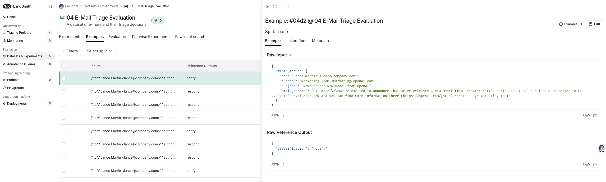

# AI Agents实战项目第4篇：智能体评估

在构建智能体系统的过程中，评估 (Evaluation) 是确保系统质量和可靠性的关键环节。本文将深入探讨如何系统性地评估智能体的性能，从单元测试到端到端测试，从结构化评估到 LLM-as-Judge 评估，为你提供完整的智能体评估构建指南。

本节的notebook地址为： [https://github.com/simfeng/agents-from-scratch/blob/main/04-evaluation/notebook.ipynb](https://github.com/simfeng/agents-from-scratch/blob/main/04-evaluation/notebook.ipynb)

## 目录

- [智能体评估概述](#智能体评估概述)
- [评估环境准备](#评估环境准备)
- [评估方法论](#评估方法论)
  - [Pytest 单元测试](#pytest-单元测试)
  - [LangSmith Datasets 评估](#langsmith-datasets-评估)
- [测试用例设计](#测试用例设计)
- [结构化评估实现](#结构化评估实现)
  - [工具调用测试](#工具调用测试)
  - [分类准确性测试](#分类准确性测试)
- [LLM-as-Judge 评估](#llm-as-judge-评估)
- [最佳实践与建议](#最佳实践与建议)
- [总结](#总结)

## 智能体评估概述

在上一节中，我们使用 LangGraph 创建了第一个 Agent，可以帮助我们回复邮件。在继续实现更多功能之前，我们需要先学习如何评估 (Evaluation) Agent 的效果。


测试环节对于一个 Agent 能否部署到生产环境有着非常重要的影响。只有通过系统性的测试，才能获得诸如回复质量、Token 消耗量、延迟、分类准确性等一系列量化指标。

我们将使用 [LangSmith](https://docs.smith.langchain.com/) 来完成这个任务。LangSmith 是 LangChain 团队开发的，用于评估和监控 LLM 应用的平台，它提供了两种主要的方式来测试 Agent：

1. **Pytest/Vitest 集成测试**：适合复杂逻辑和灵活测试场景
2. **LangSmith Datasets 评估**：适合团队协作和通用评估器场景

## 评估环境准备

首先，让我们设置评估环境：

```python
from dotenv import load_dotenv
load_dotenv("../.env")
import os
import sys
sys.path.append("..")

# 导入评估相关模块
from src.eval.email_dataset import email_inputs, expected_tool_calls, triage_outputs_list, response_criteria_list
from src.utils import format_messages_string, extract_tool_calls
from src.email_assistant import email_assistant
```

## 评估方法论

智能体评估可以从多个维度进行分类：


### Pytest 单元测试

Pytest 是 Python 的单元测试框架，语法简洁，易于上手。对于那些有复杂逻辑、很难用通用形式处理的测试场景，Pytest 也提供了足够的灵活性。

**优势特点：**
- 语法简洁，学习成本低
- 灵活性强，适合复杂测试逻辑
- 与 LangSmith 无缝集成
- 支持参数化测试

### LangSmith Datasets 评估

LangSmith Datasets 提供了数据集管理功能，你可以通过 LangSmith 的 API 来使用这些数据集测试你的应用。

**适用场景：**
- 团队协作构建测试套件
- 利用生产轨迹、标注队列、合成数据生成等功能
- 可以定义适用于数据集中每个测试用例的评估器（如相似性、精确匹配准确性等）

## 测试用例设计

测试永远都是从定义测试用例开始的，这一步很重要也很有挑战性，因为你必须清楚地知道你的 Agent 要做什么，你才能定义出正确的测试用例。

我们预先定义了一组测试用例，每个用例包含以下字段：

- `email_input`: 输入的邮件内容
- `expected_tool_calls`: 期待的工具调用结果  
- `triage_output`: 期待的分类结果
- `response_criteria`: 回复的邮件内容应该满足的标准

让我们查看一个具体的测试用例：

```python
# 邮件输入示例
email_input = {
    'author': 'Alice Smith <alice.smith@company.com>', 
    'to': 'Lance Martin <lance@company.com>', 
    'subject': 'Quick question about API documentation', 
    'email_thread': """Hi Lance,

I was reviewing the API documentation for the new authentication service and noticed a few endpoints seem to be missing from the specs. Could you help clarify if this was intentional or if we should update the docs?

Specifically, I'm looking at:
- /auth/refresh
- /auth/validate

Thanks!
Alice"""
}

# 期望的工具调用
expected_tool_calls = ['write_email', 'done']

# 期望的分类结果
triage_output = 'respond'

# 响应标准
response_criteria = """
• Send email with write_email tool call to acknowledge the question and confirm it will be investigated  
"""
```

**通过上面 4 个测试标准可以看出，我们的测试既包含端到端的结果测试，也包含特定步骤的中间过程测试。**

## 结构化评估实现

### 工具调用测试

基于上面介绍的内容，首先我们来使用 Pytest 测试 Agent 工具调用的效果：

```python
import pytest
from langsmith import testing as t

@pytest.mark.langsmith
@pytest.mark.parametrize(
    "email_input, expected_tool_calls",
    [
        (email_inputs[0], expected_tool_calls[0]),
        (email_inputs[3], expected_tool_calls[3]),
    ]   
)
def test_email_dataset_tool_calls(email_input, expected_tool_calls):
    """Test if email processing contains expected tool calls.
    
    这里只测试了工具是否被正确调用，没有测试调用顺序。
    """
    
    # Run the email assistant
    result = email_assistant.invoke({"email_input": email_input})
    
    # Extract tool calls from the result
    extracted_tool_calls = extract_tool_calls(result["messages"])
    
    # check if all expected tool calls are in the extracted ones
    missing_calls = [call for call in expected_tool_calls if call not in extracted_tool_calls]
    
    t.log_outputs({
        "missing_calls": missing_calls,
        "extracted_tool_calls": extracted_tool_calls,
        "response": format_messages_string(result["messages"])
    })
    
    assert len(missing_calls) == 0
```

**关键要点：**
- 只需要添加装饰器 `@pytest.mark.langsmith`，就可以将测试结果自动上传到 LangSmith 进行查看
- 通过装饰器 `@pytest.mark.parametrize`，可以将测试用例参数化

### 运行 Pytest 测试

我们需要在命令行中运行上述代码。首先将代码整理到 `tests/test_tools.py` 文件中，然后在命令行中切换到 `tests` 目录下，执行：

```bash
LANGSMITH_TEST_SUITE='Email assistant 04: Test Tools For Interrupt' pytest test_tools.py
```

其中，`LANGSMITH_TEST_SUITE` 是一个环境变量，用于指定测试数据集的名称。

运行结束后，在 LangSmith 平台（[https://smith.langchain.com/](https://smith.langchain.com/)）的 Datasets & Experiments 页面可以看到你的测试结果。


### 分类准确性测试

学习完了使用 Pytest 测试工具调用的结果之后，接着学习如何使用 LangSmith Datasets 来测试邮件分类（triage_router）的效果。

下图展示了 LangSmith Datasets 的工作流程：Dataset Examples 中的 inputs 会作为参数传入到 Agent 中（也就是 `email_assistant`），然后将 Agent 的输出和 reference outputs 通过 Test Function 进行比较，最后输出测试结果。


## LangSmith Datasets 评估

### 定义 Dataset

要使用 LangSmith Datasets，首先需要定义一个 Dataset 并将其上传到 LangSmith 服务上：

```python
from langsmith import Client
from src.eval.email_dataset import examples_triage

# Initialize LangSmith client
client = Client()

# Dataset name
dataset_name = "04 E-Mail Triage Evaluation"

# If the dataset doesn't exist, create it
if not client.has_dataset(dataset_name=dataset_name):
    dataset = client.create_dataset(
        dataset_name=dataset_name,
        description="A dataset of e-mails and their triage decisions."
    )
    
    # Add examples to the dataset
    client.create_examples(dataset_id=dataset.id, examples=examples_triage)
```

每个用例包含邮件输入和正确的分类结果：

```python
examples_triage = [
    {
        "inputs": {"email_input": email_input_1},
        "outputs": {"classification": triage_output_1},   # NOTE: This becomes the reference_output in the created dataset
    }, 
    # ...
]
```

上述代码执行完后，可以在 LangSmith 平台上看到我们创建的 Dataset。每个 Example 都包含一个 input 和 reference output。



### 目标函数 (Target Function)

目标函数就是要测试的函数。这里需要测试 triage_router 的效果，所以我们需要写一个目标函数，将邮件输入到 triage_router 中，然后获取其输出：

```python
def target_email_assistant(input: dict) -> dict:
    """Process an email through the workflow-based email assistant."""
    
    response = email_assistant.nodes['triage_router'].invoke({"email_input": input["email_input"]})
    return {"classification_decision": response.update['classification_decision']}
```

在具体执行时，LangSmith 的 API 会针对 dataset 中的每一条数据，将其 `inputs` 字段取出，调用 `target_email_assistant` 函数，然后将函数的输出与 `reference_outputs` 进行比较，得到一个评估结果。

**代码说明：**
- `email_assistant.nodes` 可以访问到 graph 中每一个节点
- `triage_router` 返回的是一个 Command 对象，包含 `update` 和 `goto` 两个内容，这里我们只关心 `update`，即对 State 的更新内容

### 评估函数 (Evaluator Function)

对目标函数的输出结果，应该怎么评价其好坏呢？现在我们已经有了：

- Reference outputs: `"reference_outputs": {"classification": triage_output_1} ...`
- Agent outputs: `"outputs": {"classification_decision": agent_output_1} ...`

我们希望评估 Agent's output 和 reference output 之间的差异。因此，我们将定义一个评估函数来比较它们的结果：

```python
def classification_evaluator(outputs: dict, reference_outputs: dict) -> bool:
    """Check if the answer exactly matches the expected answer."""
    return outputs["classification_decision"].lower() == reference_outputs["classification"].lower()
```

这个函数中，入参默认为：
- `outputs`: Agent's output
- `reference_outputs`: reference output

### 开始测试

当我们定义好所需要的函数后，`evaluate` 函数会帮我们将它们串联起来进行测试：

```python
experiment_results_workflow = client.evaluate(
    target_email_assistant,  # run agent
    data=dataset_name,  # dataset name
    evaluators=[
        classification_evaluator
    ],
    experiment_prefix="E-mail assistant workflow",  # name of the experiment
    max_concurrency=2,  # number of concurrent evaluations
)
```

执行结束后，我们可以在 LangSmith UI 中查看结果：


## LLM-as-Judge 评估

上面两个部分，我们分别使用 `Pytest` 测试了工具调用的效果，使用 LangSmith `evaluate()` 测试了邮件分类的效果。如下图所示，这两部分都属于单元测试 (Unit Test)，且都有着结构化的标准结果。


接下来，我们要进行整个 email assistant 的最终输出结果测试，这是一个典型的端到端 (End-to-End, E2E) 测试，将所有的过程和结果都概括在一起进行评估。

因为 Agent 的最终输出的邮件内容是不固定的，所以无法像之前那样进行结构化的测试。

测试非结构化的输出，除了人工判断外，现在最常用的方法就是使用 LLM 作为裁判（LLM-as-Judge）来进行评判。

### 定义评估结构

首先，需要定义一个结构化的输出用于处理 LLM 的评价结果：

```python
from pydantic import BaseModel, Field
from langchain.chat_models import init_chat_model

class CriteriaGrade(BaseModel):
    """Score the response against specific criteria."""

    justification: str = Field(description="The justification for the grade and score, including specific examples from the response.")
    grade: bool = Field(description="Does the response meet the provided criteria?")

# Create a global LLM for evaluation to avoid recreating it for each test
model_name = os.getenv("OPENAI_MODEL")
model_provider = os.getenv("MODEL_PROVIDER")
criteria_eval_llm = init_chat_model(model_name, model_provider=model_provider)
criteria_eval_structured_llm = criteria_eval_llm.with_structured_output(CriteriaGrade)
```
这样，每个 `criteria_eval_structured_llm` 都会按照我们定义的 `CriteriaGrade` 结构来返回结果。


### 评估标准示例

让我们查看一个具体的评估标准：

```python
success_criteria = """
• Send email with write_email tool call to acknowledge the question and confirm it will be investigated
"""
```

我们会发现，这个评价标准是非常口语化的，并且包含了需要调用的工具，很难用固定的规则来实现。

### 系统提示词

`RESPONSE_CRITERIA_SYSTEM_PROMPT` 说明了这个 LLM evaluator 的工作方式：

```python
RESPONSE_CRITERIA_SYSTEM_PROMPT = """You are evaluating an email assistant that works on behalf of a user.

You will see a sequence of messages, starting with an email sent to the user.

You will then see the assistant's response to this email on behalf of the user, which includes any tool calls made (e.g., write_email, schedule_meeting, check_calendar_availability, done).

You will also see a list of criteria that the assistant's response must meet.

Your job is to evaluate if the assistant's response meets ALL the criteria bullet points provided.

IMPORTANT EVALUATION INSTRUCTIONS:
1. The assistant's response is formatted as a list of messages.
2. The response criteria are formatted as bullet points (•)
3. You must evaluate the response against EACH bullet point individually
4. ALL bullet points must be met for the response to receive a 'True' grade
5. For each bullet point, cite specific text from the response that satisfies or fails to satisfy it
6. Be objective and rigorous in your evaluation
7. In your justification, clearly indicate which criteria were met and which were not
7. If ANY criteria are not met, the overall grade must be 'False'

Your output will be used for automated testing, so maintain a consistent evaluation approach."""
```

### 执行 LLM 评估

运行一条 LLM-as-Judge 评估的代码也比较简单：

```python
# 运行 email assistant
response = email_assistant.invoke({"email_input": email_input})

# 格式化消息用于评估
all_messages_str = format_messages_string(response["messages"])

# 执行 LLM 评估
eval_result = criteria_eval_structured_llm.invoke([
    {"role": "system", "content": RESPONSE_CRITERIA_SYSTEM_PROMPT},
    {
        "role": "user",
        "content": f"""Response criteria: {success_criteria}

Assistant's response: {all_messages_str}

Evaluate whether the assistant's response meets the criteria and provide justification for your evaluation."""
    }
])

print(eval_result.justification)
print(eval_result.grade)
```

执行完代码，会获取到一个 `CriteriaGrade` 对象，里面包含了评估过程和最后的结果。如果 `grade` 为 True，则表示评估通过，否则表示评估未通过。

但是有几点需要注意一下：
1. LLM 的评估具有随机性，可能每次输出的结果会有不同；
2. 上述的 LLM-as-Judge 代码只是一个评估方法，需要将其放入到 Pytest 或者 LangSmith 的评估框架中，才能批量执行并输出结果。

## 最佳实践与建议

### 1. 测试用例设计原则

- **全面性**：覆盖各种可能的输入场景
  - 正常情况：典型的业务场景
  - 边界情况：极端或特殊的输入
  - 异常情况：错误或无效的输入

- **代表性**：选择典型的真实世界用例
  - 基于实际生产数据设计测试用例
  - 考虑用户的真实使用模式
  - 包含不同复杂度的场景

- **可验证性**：确保每个测试用例都有明确的期望结果
  - 定义清晰的成功标准
  - 避免模糊或主观的评判标准
  - 提供具体的验证方法

- **可维护性**：测试用例应该易于理解和修改
  - 使用描述性的命名
  - 添加必要的注释和文档
  - 保持测试用例的独立性

### 2. 评估策略选择

根据不同的测试目标选择合适的评估策略：

- **单元测试**：用于测试特定功能模块
  - 工具调用正确性
  - 分类准确性
  - 数据处理逻辑

- **集成测试**：用于测试多个模块之间的协作
  - 工作流程完整性
  - 模块间数据传递
  - 状态管理正确性

- **端到端测试**：用于测试完整的用户场景
  - 完整业务流程
  - 用户体验质量
  - 系统整体性能

- **LLM-as-Judge**：用于评估开放性、创造性的输出
  - 文本质量评估
  - 语义正确性检查
  - 风格和语调评估

### 3. 性能监控指标

建立全面的性能监控体系：

- **准确性指标**：
  - 分类准确率：邮件分类的正确率
  - 工具调用正确率：工具选择和调用的准确性
  - 响应相关性：回复内容与邮件内容的相关程度

- **效率指标**：
  - 响应延迟：从输入到输出的时间
  - Token 消耗量：模型调用的成本
  - 并发处理能力：同时处理请求的数量

- **质量指标**：
  - 回复内容质量：语言表达的专业性和准确性
  - 用户满意度：基于用户反馈的评分
  - 完成率：成功处理请求的比例

- **稳定性指标**：
  - 错误率：系统出错的频率
  - 异常处理能力：对异常情况的处理效果
  - 系统可用性：服务正常运行的时间比例

## 总结

本文详细介绍了智能体评估的完整体系，从基础的单元测试到复杂的 LLM-as-Judge 评估，为你提供了构建可靠智能体系统的评估框架。

评估不仅是开发过程中的一个环节，更是确保智能体系统长期稳定运行的重要保障。希望本文能够帮助你构建出高质量、可靠的智能体应用，在实际项目中取得成功。

----

如果你觉得项目（[https://github.com/simfeng/agents-from-scratch](https://github.com/simfeng/agents-from-scratch)）对你有帮助，欢迎给个⭐️支持一下！
