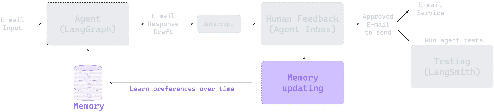

# AI Agents 实战项目第6篇：带记忆功能的智能体（Agents with Memory）

在前面的章节中，我们构建了一个具备人类反馈（Human-in-the-Loop）功能的邮件助手。这个助手能够智能分类邮件，并在关键决策点等待人类的确认和反馈。但是，每次交互都是独立的——助手无法记住你之前的偏好和反馈。

现在，我们要为邮件助手添加记忆功能，让它能够记住你的 HITL 反馈，并在未来的交互中应用这些学习到的偏好。这样，助手就能够真正地学习和适应你的工作习惯。



本节的 notebook 地址为：[https://github.com/simfeng/agents-from-scratch/blob/main/06-agents-with-memory/notebook.ipynb](https://github.com/simfeng/agents-from-scratch/blob/main/06-agents-with-memory/notebook.ipynb)

## 目录

- [LangGraph 中的 Memory 机制](#langgraph-中的-memory-机制)
  - [Thread-Scoped 和 Across-Thread Memory](#thread-scoped-和-across-thread-memory)
  - [LangGraph Store](#langgraph-store)
- [为邮件助手添加 Memory 功能](#为邮件助手添加-memory-功能)
  - [Memory 管理](#memory-管理)
  - [Memory 更新机制](#memory-更新机制)
  - [Response Agent with Memory](#response-agent-with-memory)
    - [LLM Call](#llm-call)
    - [Interrupt Handler](#interrupt-handler)
- [本地部署](#本地部署)
- [总结](#总结)

## LangGraph 中的 Memory 机制

### Thread-Scoped 和 Across-Thread Memory

首先，我们需要理解 [LangGraph 中 Memory 的工作原理](https://langchain-ai.github.io/langgraph/concepts/memory/)。LangGraph 提供了两种互补的 Memory 类型：

**Thread-Scoped Memory（限制在一次对话内，短期记忆）** 在单次对话内运行。它作为 graph state 的一部分自动管理，并通过对话范围的检查点持久化。这种记忆类型保留对话历史、上传的文件、检索的文档以及交互过程中生成的其他工件。可以把它想象成工作记忆，在一个特定对话中维护上下文，让 agent 能够引用早期的消息或操作，而不必每次都从头开始。

**Across-Thread Memory（长期记忆）** 超越了单次对话的范围，创建了一个跨越多个对话会话的持久知识库。这种记忆以 JSON 文档的形式存储在 memory store 中，按命名空间（类似文件夹）和不同的键（类似文件名）组织。与 thread-scoped 的记忆不同，这些信息即使在对话结束后也会持续存在，使系统能够回忆用户偏好、过去的决策和积累的知识。这就是让 agent 真正学习和适应的能力，而不是将每次交互都视为孤立的。


### LangGraph Store

LangGraph 中使用 [Store](https://langchain-ai.github.io/langgraph/reference/store/#langgraph.store.base.BaseStore) 类来存储记忆数据，Store 是实现上述 Memory 机制的基础，它提供了一个存储方式，可以在其中组织、检索和更新记忆。这种方法的强大之处在于，无论你使用哪种记忆类型，Store 都会提供一致的访问模式，这使得无论你是在开发过程中使用简单的内存实现，还是在部署中使用生产级数据库，都可以保持你的 agent 代码不变。

可以根据不同的[部署方式](https://langchain-ai.github.io/langgraph/tutorials/deployment/#other-deployment-options)提供不同的 Store 类实现方式：

1. **内存存储（例如，notebooks）**：
   - 使用 `from langgraph.store.memory import InMemoryStore`
   - 纯粹是内存中的 Python 字典，没有持久化
   - 进程终止时数据丢失
   - 适用于快速实验和测试
   - 可以配置[语义搜索](https://langchain-ai.github.io/langgraph/cloud/deployment/semantic_search/)

2. **使用 `langgraph dev` 的本地开发**：
   - 类似于 InMemoryStore，但具有伪持久化
   - 服务在启动时会加载本地 pickle 文件中的数据，关闭时会将数据存储到 pickle 文件中
   - 轻量且快速，无需外部数据库
   - 可以配置[语义搜索](https://langchain-ai.github.io/langgraph/cloud/deployment/semantic_search/)
   - 适合开发，但不适用于生产环境

3. **LangGraph Platform 或生产部署**：
   - 使用 PostgreSQL 和 pgvector 进行生产级持久化
   - 完全持久的数据存储，具有可靠的备份
   - 可扩展到更大的数据集
   - 可以配置[语义搜索](https://langchain-ai.github.io/langgraph/cloud/deployment/semantic_search/)
   - 默认距离度量是余弦相似度（可自定义）

本节内容，我们使用 `InMemoryStore` 来展示如何实现 Memory 功能：

```python
from langgraph.store.memory import InMemoryStore
in_memory_store = InMemoryStore()
```

Memory 通过**元组**进行命名空间（namespace）化，下面的示例中将是 (`<user_id>`, "memories")。命名空间可以是任何长度，代表任何内容，不一定要特定于用户。

```python
user_id = "1"
namespace_for_memory = (user_id, "memories")
```

使用 `store.put` 方法将记忆数据保存到 store 中的命名空间。我们指定命名空间（如上所定义）和记忆的键值对：键是记忆的唯一标识符（memory_key），值是记忆本身。

```python
import uuid
memory_key = "user_preferences"
memory = {"food_preference" : "I like pizza"}
in_memory_store.put(namespace_for_memory, memory_key, memory)
```

使用 `store.search` 方法读取命名空间中的记忆，它将返回给定用户的所有记忆作为列表。最新的记忆是列表中的最后一个。每个记忆类型都是一个 Python 类（`Item`），具有某些属性。我们可以通过 `.dict` 转换将其作为字典访问。它具有的属性如下所示，但最常用的是 `value`。

```python
memories = in_memory_store.search(namespace_for_memory)
memories[-1].dict()
```
输出如下：
```python
{'namespace': ['1', 'memories'],
 'key': 'user_preferences',
 'value': {'food_preference': 'I like pizza'},
 'created_at': '2025-07-20T07:31:31.982013+00:00',
 'updated_at': '2025-07-20T07:31:31.982015+00:00',
 'score': None}
```

看完上面的例子，我们来聊聊 langgraph 中记忆存储的存储层级。
1. 首先，最顶层是 namespace, namespace 中分为两级，第一级是用户标识，第二级是范围（Scope）
2. namespace 之下，是记忆的 key，上面的例子中，这个 key 是 user_preferences
3. 最后，是记忆的值（value），这个值本身也可以是一个 python 的字典，上面的例子中，值为 `{"food_preference": "I like pizza"}`，也可以是一个字符串，或者其他类型的数据

可以归纳一下，记忆的层级大概是这样 `ID->scope->memory_key->memory_value`，通过这四个层级，可以确定最后的记忆内容。

要在 graph 中使用这个，需要再编译（compile）的时候添加 `store` 参数：

```python
from langgraph.checkpoint.memory import InMemorySaver
checkpointer = InMemorySaver()

from langgraph.store.memory import InMemoryStore
in_memory_store = InMemoryStore()
# 使用 checkpointer 和 store 编译
graph = graph.compile(checkpointer=checkpointer, store=in_memory_store)
```

我们在这儿重点介绍一下 `InMemorySaver` 和 `InMemoryStore` 的区别：
1. 从概念的角度来讲， `InMemorySaver` 是 checkpointer，`InMemoryStore` 是 store
2. checkpointer 的作用是检查站，它会在每个需要检查的节点将当前 state 保存下来，最终它会保存所有节点的 state
3. store 的目的是存储记忆，记忆不像 checkpointer，把所有的对话内容都记录下来，它更重要的作用是归纳记录那些重要的事情，比如“你喜欢吃什么”，而不是“我今天早上吃了什么，中午吃了什么，晚上吃了什么”
4. store 中的记忆，可以是从 checkpointer 中的历史对话数据中总结出来的，也可以是用户人为自己添加的
5. checkpointer 在一次对话结束之后，就没用了，而 store 是长期的，可以跨越多次对话

编译好之后，就可以在 graph 的任何节点中访问 store 数据，下面的内容将会详细介绍。

## 为邮件助手添加 Memory 功能

让我们将带有 HITL（Human-in-the-loop）功能的 graph 添加记忆功能。这和之前章节的内容非常相似。我们只需在从用户那里获得反馈时更新 store 中的记忆，因为这些反馈才能正确反映用户的行为偏好。


### Memory 管理

我们*想要*做的事情相当简单：我们想要将反馈添加到记忆 `Store` 中。如果我们用 `Store` 编译 graph，我们可以在任何节点中访问它。

但我们在上面的内容已经提到过，`Store` 中存储的记忆（memory）不是将所有的历史对话完整的存下来，因此我们必须回答两个问题：

1) 我们希望记忆如何结构化？
2) 我们希望如何更新记忆？

对于 1），为了便于演示，我们将记忆存储为字符串，而不是像上面的例子一样是个字典。在下面的函数中，我们将从 store 中获取记忆，如果不存在则用默认值初始化。

```python
def get_memory(store, namespace, default_content=None):
    """从 store 获取记忆，如果不存在则用默认值初始化。
    
    Args:
        store: LangGraph BaseStore 实例，用于搜索现有记忆
        namespace: 定义记忆命名空间的元组，例如 ("email_assistant", "triage_preferences")
        default_content: 如果记忆不存在时使用的默认内容
        
    Returns:
        str: 记忆配置文件的内容，来自现有记忆或默认值
    """
    # 使用命名空间和键搜索现有记忆
    user_preferences = store.get(namespace, "user_preferences")
    
    # 如果记忆存在，返回其内容（值）
    if user_preferences:
        return user_preferences.value
    
    # 如果记忆不存在，将其添加到 store 并返回默认内容
    else:
        # 命名空间、键、值
        store.put(namespace, "user_preferences", default_content)
        user_preferences = default_content
    
    # 返回默认内容
    return user_preferences
```

### Memory 更新机制

对于 2）更新记忆，我们可以使用 openai 提供的一些技巧来帮助我们更新记忆：

* 为了获得最佳性能，在提示的开始和结尾重复关键指令
* 创建清晰、明确的指令
* 使用 XML 分隔符进行结构化
* 提供示例

我们使用结构化输出来确保记忆更新的一致性：

```python
class UserPreferences(BaseModel):
    """基于用户反馈的更新用户偏好。"""

    chain_of_thought: str = Field(
        description="关于需要添加/更新哪些用户偏好的推理（如果需要）"
    )
    user_preferences: str = Field(description="更新的用户偏好")


def update_memory(store, namespace, messages):
    """更新 store 中的记忆。

    Args:
        store: LangGraph BaseStore 实例，用于更新记忆
        namespace: 定义记忆命名空间的元组，例如 ("email_assistant", "triage_preferences")
        messages: 用于更新记忆的消息列表
    """

    # 获取现有记忆
    user_preferences = store.get(namespace, "user_preferences")

    # 更新记忆
    model_name = os.getenv("OPENAI_MODEL")
    model_provider = os.getenv("MODEL_PROVIDER")
    llm = init_chat_model(
        model=model_name, model_provider=model_provider, temperature=0.0
    ).with_structured_output(UserPreferences)
    result = llm.invoke(
        [
            {
                "role": "system",
                "content": MEMORY_UPDATE_INSTRUCTIONS.format(
                    current_profile=user_preferences.value, namespace=namespace
                ),
            },
        ]
        + messages
    )

    # 将更新的记忆保存到 store
    store.put(namespace, "user_preferences", result.user_preferences)
```

`update_memory()` 函数的代码中，我们可以发现，记忆存储的是通过 LLM 归纳后的用户行为偏好，并不是原始的对话内容。而且有个很重要的点，记忆是有默认值的，这个默认值可以理解为一个初始的比较通用的原则，在记忆不断更新的过程中，将这个比较通用的原则慢慢变成这对不同用户的专属原则。

为了做好用户行为偏好归纳的工作，提示词 `MEMORY_UPDATE_INSTRUCTIONS` 起着至关重要的作用，下面是其具体内容：

```text
## Role and Objective

You are a memory profile manager for an email assistant agent that selectively updates user preferences based on
feedback messages from human-in-the-loop interactions with the email assistant.

## Instructions

 • NEVER overwrite the entire memory profile
 • ONLY make targeted additions of new information
 • ONLY update specific facts that are directly contradicted by feedback messages
 • PRESERVE all other existing information in the profile
 • Format the profile consistently with the original style
 • Generate the profile as a string

## Reasoning Steps

 1. Analyze the current memory profile structure and content
 2. Review feedback messages from human-in-the-loop interactions
 3. Extract relevant user preferences from these feedback messages (such as edits to emails/calendar invites,
    explicit feedback on assistant performance, user decisions to ignore certain emails)
 4. Compare new information against existing profile
 5. Identify only specific facts to add or update
 6. Preserve all other existing information
 7. Output the complete updated profile

## Example

<memory_profile>                                                                                                   

RESPOND:                                                                                                           

 • wife                                                                                                            
 • specific questions                                                                                              
 • system admin notifications                                                                                      

NOTIFY:                                                                                                            

 • meeting invites                                                                                                 

IGNORE:                                                                                                            

 • marketing emails                                                                                                
 • company-wide announcements                                                                                      
 • messages meant for other teams                                                                                  

</memory_profile>                                                                                                  

<user_messages>                                                                                                    

"The assistant shouldn't have responded to that system admin notification."                                        

</user_messages>                                                                                                   

<updated_profile>                                                                                                  

RESPOND:                                                                                                           

 • wife                                                                                                            
 • specific questions                                                                                              

NOTIFY:                                                                                                            

 • meeting invites                                                                                                 
 • system admin notifications                                                                                      

IGNORE:                                                                                                            

 • marketing emails                                                                                                
 • company-wide announcements                                                                                      
 • messages meant for other teams                                                                                  

</updated_profile>   


## Process current profile for {namespace}

<memory_profile> {current_profile} </memory_profile>

Think step by step about what specific feedback is being provided and what specific information should be added or
updated in the profile while preserving everything else.

Think carefully and update the memory profile based upon these user messages:
```

这段提示词之后，再加上用户的反馈信息，LLM 便可以总结出用户的行为偏好，更新到记忆系统里。

### Response Agent with Memory

上面的内容中已经定义好了所需的函数 `get_memory()` 和 `update_memory()`，我们可以在生成响应时使用记忆中存储的偏好，来生成更个性化的响应。

这里，我们只展示部分 Response Agent 中需要集成记忆功能的地方，更完整的内容，可以去看 [notebook](https://github.com/simfeng/agents-from-scratch/blob/main/06-agents-with-memory/notebook.ipynb) 中的实现。

#### LLM Call

LLM Call 是 reponse agent 的大脑，决定是否需要调用工具以及调用哪些工具。现在与之前不同的是，我们需要将一些用户偏好相关的内容加入到提示词中，为此，需要做以下调整：
1. 提示词模版 `agent_system_prompt_hitl_memory` 中需要加入用户偏好相关的内容；
2. 通过 `get_memory()` 函数获取具体的偏好记忆

下面是具体的代码：

```python
def llm_call(state: State, store: BaseStore):
    """LLM 决定是否调用工具"""

    # 搜索现有的日历偏好相关的记忆
    cal_preferences = get_memory(
        store, ("email_assistant", "cal_preferences"), default_cal_preferences
    )

    # 搜索现有的回复偏好相关的记忆
    response_preferences = get_memory(
        store, ("email_assistant", "response_preferences"), default_response_preferences
    )

    return {
        "messages": [
            llm_with_tools.invoke(
                [
                    {
                        "role": "system",
                        "content": agent_system_prompt_hitl_memory.format(
                            tools_prompt=HITL_MEMORY_TOOLS_PROMPT,
                            background=default_background,
                            response_preferences=response_preferences,
                            cal_preferences=cal_preferences,
                        ),
                    }
                ]
                + state["messages"]
            )
        ]
    }
```

#### Interrupt Handler

类似地，我们在中断处理器中添加记忆功能。当用户编辑邮件回复或日历邀请时，我们会更新相应的偏好记忆。

这里，我们展示的场景是，用户直接（edit）修改了大语言模型提出的调用 `write_email` 工具的参数。工具执行完成后，进行记忆更新环节，做法是调用 `update_memory()` 函数，并将 LLM 生成的参数和用户调整后的参数放在同一个提示词中，让 LLM 总结出用户的偏好。


```python
# 在用户编辑邮件时更新记忆
if tool_call["name"] == "write_email":
    # 执行编辑后的参数
    observation = tool.invoke(edited_args)
    
    # 添加工具响应消息
    result.append({"role": "tool", "content": observation, "tool_call_id": current_id})

    # 更新记忆
    update_memory(store, ("email_assistant", "response_preferences"), [{
        "role": "user",
        "content": f"用户编辑了邮件回复。这是助手生成的初始邮件：{initial_tool_call}。这是编辑后的邮件：{edited_args}。遵循上述所有指令，并记住：{MEMORY_UPDATE_INSTRUCTIONS_REINFORCEMENT}。"
    }])
```

`MEMORY_UPDATE_INSTRUCTIONS_REINFORCEMENT` 说明了一些更新记忆过程中需要遵循的原则，这和开始的系统提示词 `MEMORY_UPDATE_INSTRUCTIONS` 相呼应，很好的遵守了 openai 所提出的一条建议：**为了获得最佳性能，在提示的开始和结尾重复关键指令**。

```text
Remember:                                                                                                          

 • NEVER overwrite the entire memory profile                                                                       
 • ONLY make targeted additions of new information                                                                 
 • ONLY update specific facts that are directly contradicted by feedback messages                                  
 • PRESERVE all other existing information in the profile                                                          
 • Format the profile consistently with the original style                                                         
 • Generate the profile as a string 
 ```

## 本地部署


最后，我们会将所有的代码都整理到 `src/email_assistant_hitl_memory.py` 中，修改 `langgraph.json` 中相关的配置，并通过 `langgraph dev` 启动本地服务。

测试邮件：
```json
{
  "author": "Alice Smith <alice.smith@company.com>",
  "to": "John Doe <john.doe@company.com>",
  "subject": "Quick question about API documentation",
  "email_thread": "Hi John,\nI was reviewing the API documentation for the new authentication service and noticed a few endpoints seem to be missing from the specs. Could you help clarify if this was intentional or if we should update the docs?\nSpecifically, I'm looking at:\n- /auth/refresh\n- /auth/validate\nThanks!\nAlice"
}
```

如前所述，访问 [dev.agentinbox.ai](https://dev.agentinbox.ai/)，你可以很容易地进行测试：

* Graph name：来自 `langgraph.json` 文件的名称（`email_assistant_hitl_memory`）
* Graph URL：`http://127.0.0.1:2024/`

点击 LangGraph Studio 中的 Memory 按钮可以查看实时的记忆更新情况：


## 总结

通过本章的学习，我们成功地为邮件助手添加了记忆功能，让它能够从用户的反馈中学习并持续改进。这种能力让 AI 助手从简单的任务执行者转变为一个懂你的伙伴。

不过，我们当前的记忆模式和更新都还非常简单：

* 使用字符串作为存储模式
* 总是用新的记忆覆盖旧的记忆
* 缺少[语义搜索](https://langchain-ai.github.io/langgraph/cloud/deployment/semantic_search/)（Semantic search）功能

这些都是后续可以继续学习的方向，此外，langgraph 还提供了 [LangMem](https://langchain-ai.github.io/langmem/) 进行更高级的记忆管理。

Memory 功能的核心价值在于：它让 AI 系统能够积累经验，就像人类一样。每次交互都不再是孤立的事件，而是持续学习过程的一部分。这种记忆能力使得 AI 助手能够：

- 理解你的个人偏好和工作习惯
- 适应你的沟通风格
- 记住你的决策模式
- 随着时间推移变得更加智能和个性化

结合 HITL 和 Memory 功能，我们构建了一个既智能又可控的系统。它能够自动处理大部分工作，同时在关键时刻寻求你的指导，并将这些指导转化为长期的学习成果。这就是真正实用的 AI 助手应该具备的能力——不仅仅是执行任务，更要理解和适应使用者的需求。
