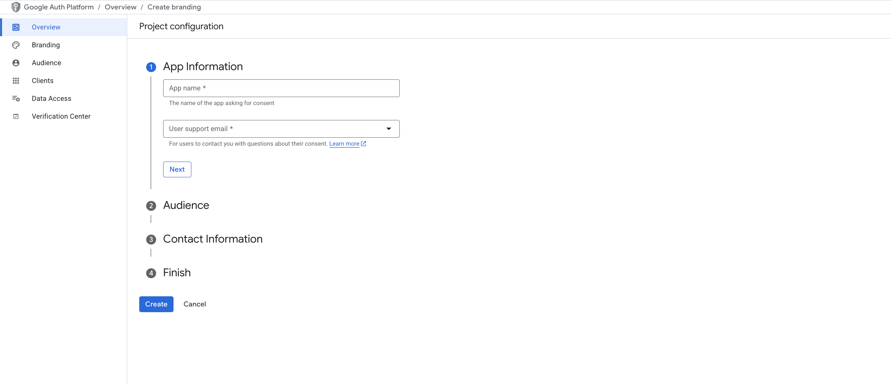

# AI Agents 实战项目第7篇：Gmail 集成（Gmail Integration）

经过前面的学习，我们已经构建了一个具备记忆功能的邮件助手，它可以学习用户偏好并持续改进。不过到目前为止，我们使用的都是模拟的邮件和日历工具。在这一章中，我们要让这个助手真正"上岗"了，连接到真实的 Gmail 和 Google Calendar API，处理你的邮件。

本章内容没有 notebook 部分，所有代码都整理到了 `src/email_assistant_hitl_memory_gmail.py` 中。

## 目录

- [定义工具](#定义工具)
- [设置凭据](#设置凭据)
  - [1. 设置 Google Cloud 项目并启用必需的 API](#1-设置-google-cloud-项目并启用必需的-api)
  - [2. 设置身份验证文件](#2-设置身份验证文件)
- [本地部署使用](#本地部署使用)
  - [1. 本地测试](#1-本地测试)
  - [2. 连接到 Agent Inbox](#2-连接到-agent-inbox)
- [总结](#总结)

## 定义工具

在 `src/email_assistant_hitl_memory_gmail.py` 中，我们把原来的模拟工具替换成了真实的 Gmail 和 Google Calendar 工具。这些工具的功能描述如下：

```python
GMAIL_TOOLS_PROMPT = """
1. fetch_emails_tool(email_address, minutes_since) - Fetch recent emails from Gmail
2. send_email_tool(email_id, response_text, email_address, additional_recipients) - Send a reply to an email thread
3. check_calendar_tool(dates) - Check Google Calendar availability for specific dates
4. schedule_meeting_tool(attendees, title, start_time, end_time, organizer_email, timezone) - Schedule a meeting and send invites
5. triage_email(ignore, notify, respond) - Triage emails into one of three categories
6. Done - E-mail has been sent
"""
```

这里面的 send_email_tool、check_calendar_tool、schedule_meeting_tool 都是通过 Google Cloud 平台调用相应的 API。接下来我们来看看如何申请这些 API 的使用权限。

## 设置凭据

### 1. 设置 Google Cloud 项目并启用必需的 API

#### 创建 Google Cloud 项目

首先在 [Google Cloud Console](https://console.cloud.google.com/projectcreate) 创建一个新项目，我们后面申请的所有 API 权限都会关联到这个项目。

#### 启用必要的 API

1. 启用 [Gmail API](https://developers.google.com/workspace/gmail/api/quickstart/python#enable_the_api)
2. 启用 [Google Calendar API](https://developers.google.com/workspace/calendar/api/quickstart/python#enable_the_api)

#### 创建 OAuth 凭据

1. 按照[这个指南](https://developers.google.com/workspace/gmail/api/quickstart/python#authorize_credentials_for_a_desktop_application)为桌面应用程序创建授权凭据
2. 在控制台中进入 凭据 → 创建凭据 → OAuth 客户端 ID
3. 应用程序类型选择"Desktop App"
4. 点击"创建"

小提醒：如果你用的是个人邮箱（不是 Google Workspace），记得在"Audience"设置中选择"External"。



> 然后，在 Audience 页面将自己的邮箱添加为测试用户
 
5. 保存下载的 JSON 文件（下一步需要它）

### 2. 设置身份验证文件

将下载的客户端密钥 JSON 文件移动到 `.secrets` 目录

```bash
# 创建 secrets 目录
mkdir -p src/tools/gmail/.secrets

# 将下载的客户端密钥移动到 secrets 目录
mv /path/to/downloaded/client_secret.json src/tools/gmail/.secrets/secrets.json
```

运行 Gmail 设置脚本

```bash
# 运行 Gmail 设置脚本
python src/tools/gmail/setup_gmail.py
```

- 运行后会打开浏览器让你登录 Google 账户进行授权
- 授权完成后会在 `.secrets` 目录生成 `token.json` 文件
- 这个 token 就是我们访问 Gmail API 的通行证

## 本地部署使用

### 1. 本地测试

完成身份验证设置后，先在一个终端启动 LangGraph 服务：

```bash
langgraph dev
```

然后在另一个终端运行测试脚本：

```bash
python src/tools/gmail/run_ingest.py --email <your-email@gmail.com> --minutes-since 1000
```

- LangGraph 服务默认会在 `http://127.0.0.1:2024` 启动
- 这个脚本会抓取 Gmail 中最近1000分钟内的邮件，然后发送给我们的邮件助手处理

这个脚本支持的参数如下：

- `--graph-name`：要使用的 LangGraph 名称（默认："email_assistant_hitl_memory_gmail"）
- `--email`：要获取邮件的邮箱地址
- `--minutes-since`：仅处理比此分钟数更新的邮件（默认：60）
- `--url`：LangGraph 部署的 URL（默认：http://127.0.0.1:2024）
- `--rerun`：处理已经处理过的邮件（默认：false）
- `--early`：处理一封邮件后停止（默认：false）
- `--include-read`：包括已读邮件（默认仅处理未读邮件）
- `--skip-filters`：处理所有邮件而不过滤（默认仅处理您不是发送者的线程中的最新消息）


### 2. 连接到 Agent Inbox

运行测试脚本后，你可以在 [Agent Inbox](https://dev.agentinbox.ai/) 中添加对应的收件箱，配置参数如下：
* 部署 URL：http://127.0.0.1:2024
* 助手/Graph ID：`email_assistant_hitl_memory_gmail`
* 名称：`Graph Name`

添加完成后就能看到相应的中断任务了。

整个测试流程建议这样进行：先用其他邮箱给测试邮箱发一封邮件，然后运行测试脚本，最后在 Agent Inbox 中查看处理结果。

## 总结

到这里，我们的邮件助手终于从"纸上谈兵"变成了真正可用的工具。通过集成 Gmail 和 Google Calendar API，它现在可以处理真实的邮件了。

经过七个章节的学习，我们从零开始构建了一个功能完整的 AI Agent 邮件助手，涵盖了工具调用、人机交互、记忆学习等核心概念。更重要的是，这不只是一个演示项目，而是一个真正可以投入使用的实用工具，而且难度不低。

最后，聊一点感悟：在 AI Agent 时代，我发现企业的开放能力变得越来越重要了。很多企业都有开放平台，但开发体验却参差不齐。其实开放能力本质上反映的是企业的基础能力——技术架构、规范标准、流程体系、文档质量等等。基础越扎实，开放能力就越强，基于这些平台构建的 AI 应用上限也就越高。